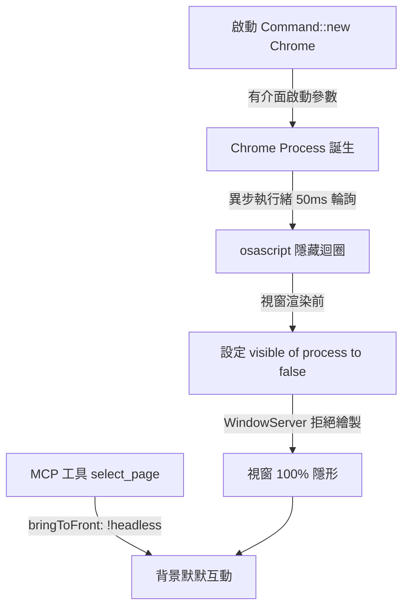

# macOS 完美的背景 Chrome 隱形技術與實作原理 🦀

在 `ask-chatgpt` 中，為了解決網頁自動化工具經常面臨的 **Cloudflare Bot 偵測**與 **macOS 視窗閃爍**問題，我們開發了一套極具巧思且穩定的「真．背景隱形（Headless Bypass）」技術。

本文件詳細記錄了這套技術的挑戰、核心原理與最終解決方案，供未來開發與維護參考。

---

## 1. 核心挑戰：Cloudflare 與 視窗克制

### 1.1 為什麼不能用標準的 `--headless` 模式？
當我們使用 Chrome 內建的 `--headless` 參數時，Chrome 會啟用無介面渲染。然而，這會暴露出非常明顯的機器人特徵（例如 `navigator.webdriver` 屬性為 `true`、特定的 Chrome 屬性缺失、以及缺乏部分 WebGL 繪圖特徵）。
這會直接導致 `chatgpt.com` 啟用的 **Cloudflare Turnstile** 阻擋請求，讓頁面卡在驗證碼或拋出 `No assistant message found` 錯誤。因此，**我們必須啟動標準的 Headful（有介面）Chrome 才能完美繞過偵測。**

### 1.2 有介面啟動的視覺困擾
在 macOS 上，一旦啟動 Headful Chrome，作業系統的視窗管理器（WindowServer）預設會為其繪製一個實體視窗，這會造成：
- 視窗強行跳出、搶奪焦點，打斷使用者的工作流程。
- 使用 `--window-position=-2000,-2000` 來將視窗定位到螢幕外，會被 macOS 視窗管理器**強制黏回（Clamp）** 螢幕邊緣（如 `0,26`），因為 macOS 預設不允許有介面程式的視窗控制列完全超出可視範圍。

---

## 2. 解決方案：三大隱形技術之結合

為了解決上述挑戰，我們在 `src/main.rs` 中融合了三項底層技術，達成了 **「完全無感、完全隱形、完美繞過偵測」** 的境界。



---

### 技術一：高頻微秒級主動式防護 (Immediate Hiding Loop)

如果只在啟動後執行一次隱藏指令，由於 Chrome 的啟動時間不確定，往往會因為時間差導致「視窗先閃現一下，隨後才縮小消失」。

**我們的解決方案：**
在 Rust 中啟動 Chrome 後，立即於異步執行緒（`thread::spawn`）中啟動一個**高頻微秒級輪詢迴圈**：
- **頻率與週期**：每隔 `50 毫秒 (ms)` 執行一次，連續執行 **40 次**（涵蓋啟動後的黃金 2 秒）。
- **AppleScript 精準隱藏**：調用 macOS 的 `osascript` 工具，透過 UNIX PID 精準鎖定我們剛創建的 Chrome 程序：
  ```applescript
  tell application "System Events" to try
      set visible of first application process whose unix id is <PID> to false
  end try
  ```
- **效果**：在 Chrome 還在向 macOS 註冊、視窗還沒來得及繪製出來的**極初期**，我們就將該程序的 `visible` 設為 `false`。macOS 視窗管理器收到此屬性後，會直接**拒絕繪製**該視窗，從源頭扼殺了視窗的閃爍，實現了開機即無影。

---

### 技術二：帶有精準 PID 隔離的 AppleScript 控制

一般網路上常見的 AppleScript 隱藏指令為：
`tell application "Google Chrome" to set visible to false`
這會產生嚴重的副作用——**這會連帶把使用者平常拿來上網、工作用的主要 Chrome 視窗也一併隱藏**，體驗極差。

**我們的解決方案：**
我們利用 Rust 動態獲取當前運行的特定背景 Chrome 的系統 PID（透過 `child.id()` 或是透過 `lsof -iTCP:9223` 獲取的監聽 PID），並在 AppleScript 中使用 `whose unix id is <PID>` 進行篩選。
- **效果**：**只隱藏我們用來做 ChatGPT 互動的那個特定 PID 程序**，使用者的其他日常 Chrome 視窗完全不受干擾，兩者完美隔離。

---

### 技術三：動態 `bringToFront` 流程參數控制

這是我們發現的另一個關鍵「背刺」點：
在我們的流程中，需要頻繁調用 `chrome-devtools` MCP 伺服器的 `select_page` 工具來選取 ChatGPT 分頁並進行內容擷取。
- **舊行為**：每一次調用 `select_page` 時，都傳遞了 `"bringToFront": true`。在 Chromium 的內部機制中，這個操作會發送 `Page.bringToFront` 指令，這會**強制將 Chrome 應用程式帶到最前台並取消隱藏**。這就是為什麼每次一抓取內容，原本藏好的瀏覽器又會突然彈出來的原因。
- **新行為**：我們重構了 `open_url_tab` 和 `ensure_chatgpt_tab`，使其支持 `headless` 參數。在執行背景任務（headless=true）時，將該參數動態設為：
  ```json
  "bringToFront": !headless
  ```
- **效果**：當處於背景模式時，`bringToFront` 為 `false`，Chrome 默默地在後台執行 DOM 解析、腳本執行與按鈕點擊，**終身不浮出水面**。

---

## 3. 程式碼核心實作位置

### 3.1 啟動與極速輪詢隱藏
實作於 `src/main.rs` 的 `start_chrome_if_needed` 函數中：
```rust
if headless {
    let pid = child.id();
    thread::spawn(move || {
        // 高頻輪詢設定 visible 為 false，徹底防止視窗閃爍
        for _ in 0..40 {
            let script = format!(
                "tell application \"System Events\" to try\nset visible of first application process whose unix id is {} to false\nend try",
                pid
            );
            let _ = Command::new("osascript")
                .arg("-e")
                .arg(&script)
                .status();
            thread::sleep(Duration::from_millis(50));
        }
    });
}
```

### 3.2 動態 bringToFront 控制
實作於 `src/main.rs` 的 `ensure_chatgpt_tab` 函數中：
```rust
call_mcp_tool(
    config_path,
    "select_page",
    serde_json::json!({
        "pageId": page.id,
        "bringToFront": !headless // 只有在非 headless 模式下才帶到前景
    }),
)?;
```

---

## 4. 總結

透過這套結合了：
1. **微秒級啟動異步隱藏輪詢**
2. **精準 PID 隔離**
3. **取消 DevTools `bringToFront` 前景調用**

我們成功解決了有介面 Chrome 做背景自動化時的所有視覺困擾。這是一套極其強大、優雅且使用者無感的實作方案！
